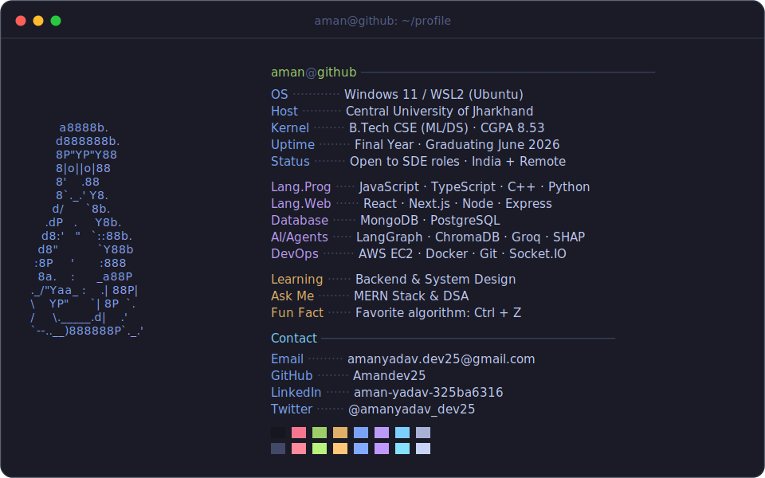

  

<h3 align="center">🚀 Currently building AI-agent tooling & full-stack systems · open to SDE roles</h3>

  
  
  
  

---

### 🧰 Tech Stack

  
  
  
  
   
  
  
  
  
   
  
  
  
  
  
   
  
  
  
  

---

### 📊 GitHub Stats

  
  

  

---

### 📌 Featured Projects

| Project | Stack | What it does |
| --- | --- | --- |
| **VeriAgent** | LangGraph · ChromaDB · Groq | Multi-agent identity verification pipeline |
| **FinanceAI** | React · Node/Express · MongoDB · Groq | AI-assisted personal finance app |
| **QuickChat** | Socket.IO · JWT · MongoDB | Real-time chat, 34-test suite |
| **DSA Coach AI** | React · Vite · Groq | Interactive DSA practice & hints |

<i>“My favorite algorithm? Ctrl + Z 🕹️”</i>

